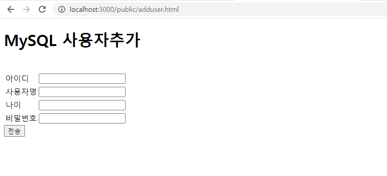
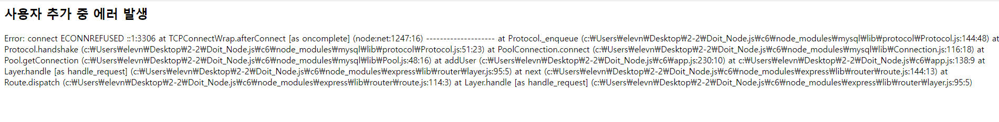
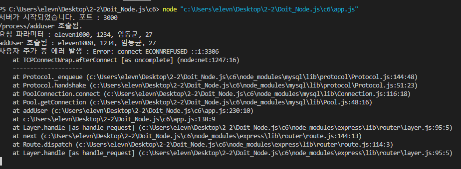
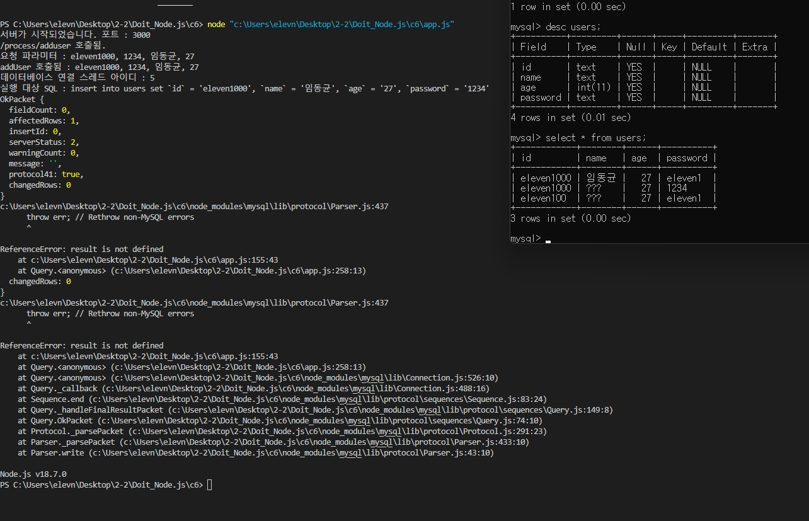
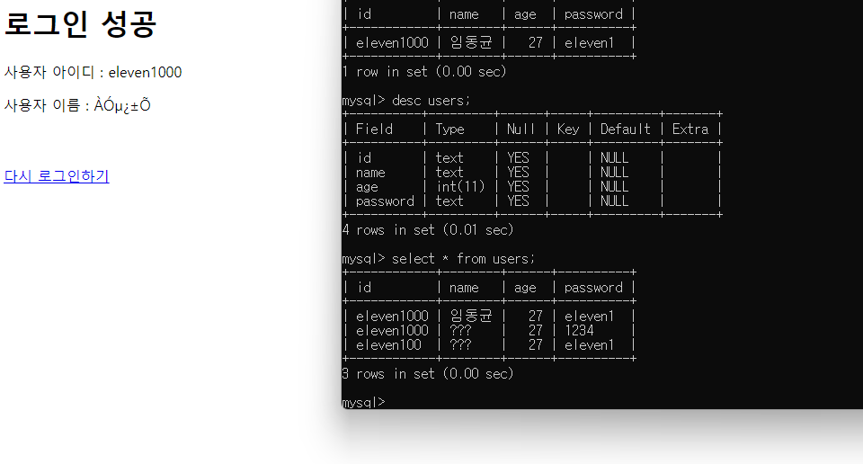
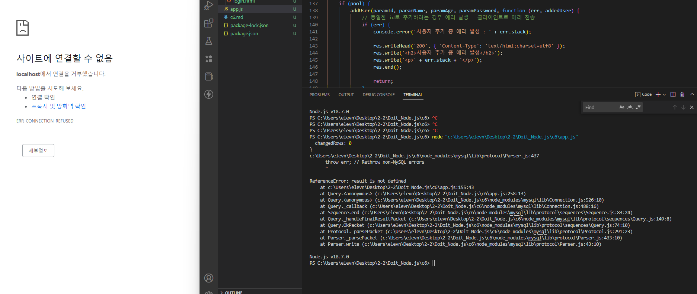
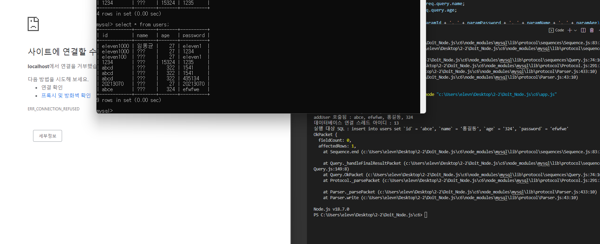
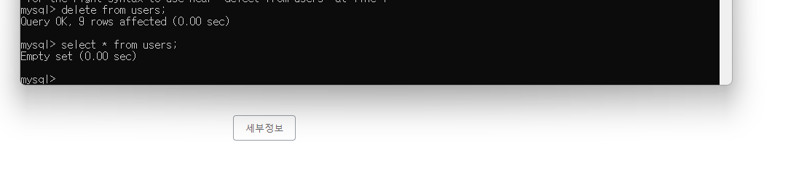
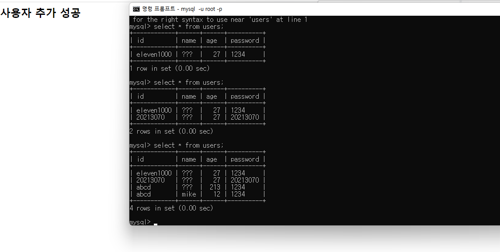

# 6장 - 데이터베이스 사용하기
## 6. MySQL 데이터베이스 사용하기

MySQL - 관계형 데이터베이스

### 관계형 데이터베이스 간단하게 이해하기

테이블을 만들어 데이터를 저장

어떤 타입으로 데이터가 들어갈지 정의한 후 데이터 입력

한 줄에 해당하는 데이터 → 레코드, 검색 가능

1단계 - 데이터베이스 연결 → 2단계 - 테이블 생성 → 3단계 - 레코드 추가 → 4단계  - 데이터 조회

npm install mysql 로 모듈 설치

관계형 데이터베이스 연결하면 메모리 리소스 과다하게 사용 → 한번 만든 연결 객체 커넥션 풀에 넣고 다음번 요청이 있을 때 다시 사용, 너무 많은 연결 발생하지 않도록 커넥션 풀의 최대치 설정. 연결을 사용한 후 다시 풀에 넣어줘야 하는 제약 있음. createPool 메소드로 객체를 넣어줌

| 속성 | 설명 |
| --- | --- |
| connectionLimit | 커넥션 풀에서 만들 수 있는 최대 연결 개수를 설정 |
| host | 연결할 호스트 이름을 설정. 내 컴퓨터면 localhost, 127.0.0.1 입력 |
| port | 데이터베이스 포트 번호 설정. 디폴트는 3306 |
| user | 데이터베이스 사용자 아이디 설정. 디폴트는 root |
| password | 데이터베이스 사용자 비밀번호 설정 |
| database | 데이터베이스 이름 설정 |
| debug | 데이터베이스 처리 과정 로그로 남길지 설정 |

```jsx
var mysql = require('mysql');

var pool = mysql.createPool({
    connectionLimit: 10,
    host: 'localhost',
    user: 'root',
    password: 'apmsetup',
    database: 'test',
    debug: false
});
```

이후로는 pool 객체에서 연결 객체 가져와 사용 가능.

사용자 추가 기능 넣기 위해 addUser 함수 생성

```jsx
var addUser = function (id, name, age, password, callback) {
    console.log('addUser 호출됨.');

    //커넥션 풀에서 연결 객체 가져옴
    pool.getConnection(function (err, conn) {
        if (err) {
            if (conn) {
                conn.release();
            }
            callback(err.null);
            return;
        }
        console.log('데이터베이스 연결 스레드 아이디 : ' + conn.threadId);

        var exec = conn.query('inseert into users set ?', data, function (err, result) {
            conn.release();
            console.log('실행 대상 SQL:' + exec.sql);

            if (err) {
                console.log('SQL 실행 시 오류 발생함.');
                console.dir(err);

                callback(err, null);

                return;
            }

            callback(null, result);
        })
    })
}
```

id, name, age, passwd, callback 총 5개의 파라미터 전달. 앞의 4개는 웹 브라우저에서 요청할 때 전달한 요청 파라미터고 callback은 결과를 처리할 콜백 함수이다.

pool 객체의 getConnection 메소드 호출 → 커넥션 풀에서 연결 객체 하나 가져온 후 콜백 함수 호출 → conn 파라미터로 연결 객체 전달, 연결 객체에 query 메소드 있어 SQL문 실행. 위에서는 데이터 추가하는 insert문 사용, ?기호는 query 메소드 호출할 때 전달하는 추가 파라미터 사용해 대체한 후 시행하는 기호 → 결과가 result 파라미터로 전달 → SQL문 실행한 후에 연결 객체의 release 메소드 호출해 연결 객체를 커넥션 풀로 반환, 실행 결과는 콜백 함수 쪽에서 처리할 수 있도록 callback(null,result) 코드를 넣어 콜백 함수 실행

### 사용자 추가 요청 처리 함수

```jsx
//사용자 추가 요청 처리 함수
router.route('/process/adduser').post(function (req, res) {
    console.log('/ process / adduser 호출됨.');
    var paramId = req.body.id || req.query.id;
    var paramPassword = req.body.password || req.query.password;
    var paramName = req.body.name || req.query.name;
    var paramAge = req.body.age || req.query.age;

    console.log('요청 파라미터:' + paramId + ',' + paramPassword + ',' + paramName + ',' + paramAge);
    //pool 객체 초기화된 경우 addUSer 함수 호출해 사용자추가
    if (pool) {
        addUser(paramId, paramName, paramAge, paramPassword, function (err, addUSer) {
            if (err) {
                console.log('사용자 추가 중 오류 발생:' + err.stack);
                res.writeHead('200', { 'content-Type': 'text/html;charset=utf8' });
                res.write('<h2>사용자 추가 중 오류 발생</h2>');
                res.write('<p>' + err.stack + '</p>');
                res.end();
                return;
            }
            if (addUSer) {
                console.dir(addedUser);

                console.log('insertde' + addedUser.affectedRows + 'rows');

                var insertId = addedUSer.insertId;
                console.log('추가한 레코드의 아이디 : ' + insertId);
                res.writeHead('200', { 'content-Type': 'text/html;charset=utf8' });
                res.write('<h2>사용자 추가 성공</h2>');
                res.end();
            } else {
                res.writeHead('200', { 'content-Type': 'text/html;charset=utf8' });
                res.write('<h2>사용자 추가 실패</h2>');
                res.end();
            }
        });
    } else {
        res.writeHead('200', { 'content-Type': 'text/html;charset=utf8' });
        res.write('<h2>데이터베이스 연결 실패</h2>');
        res.end();
    }
});
```

post 방식으로 요청된 /process/adduser 패스 처리?

웹 브라우저로부터 id, name, age, password 파라미터 받아 처리하도록 하고 addUser 함수 실행 결과 확인한 후 응답 보냄

mysql-node.js 연결

```jsx
// Express 기본 모듈 불러오기
var express = require('express')
    , http = require('http')
    , path = require('path');

// Express의 미들웨어 불러오기
var bodyParser = require('body-parser')
    , cookieParser = require('cookie-parser')
    , static = require('serve-static')
    , errorHandler = require('errorhandler');

// 에러 핸들러 모듈 사용
var expressErrorHandler = require('express-error-handler');

// Session 미들웨어 불러오기
var expressSession = require('express-session');

//===== MySQL 데이터베이스를 사용할 수 있도록 하는 mysql 모듈 불러오기 =====//
var mysql = require('mysql');

//===== MySQL 데이터베이스 연결 설정 =====//
var pool = mysql.createPool({
    connectionLimit: 10,
    host: 'localhost',
    user: 'root',
    password: 'apmsetup',
    database: 'test',
    debug: false
});

// 익스프레스 객체 생성
var app = express();

// 설정 파일에 들어있는 port 정보 사용하여 포트 설정
app.set('port', process.env.PORT || 3000);

// body-parser를 이용해 application/x-www-form-urlencoded 파싱
app.use(bodyParser.urlencoded({ extended: false }))

// body-parser를 이용해 application/json 파싱
app.use(bodyParser.json())

// public 폴더를 static으로 오픈
app.use('/public', static(path.join(__dirname, 'public')));

// cookie-parser 설정
app.use(cookieParser());

// 세션 설정
app.use(expressSession({
    secret: 'my key',
    resave: true,
    saveUninitialized: true
}));

//===== 라우팅 함수 등록 =====//

// 라우터 객체 참조
var router = express.Router();

// 로그인 처리 함수
router.route('/process/login').post(function (req, res) {
    console.log('/process/login 호출됨.');

    // 요청 파라미터 확인
    var paramId = req.body.id || req.query.id;
    var paramPassword = req.body.password || req.query.password;

    console.log('요청 파라미터 : ' + paramId + ', ' + paramPassword);

    // pool 객체가 초기화된 경우, authUser 함수 호출하여 사용자 인증
    if (pool) {
        authUser(paramId, paramPassword, function (err, rows) {
            // 에러 발생 시, 클라이언트로 에러 전송
            if (err) {
                console.error('사용자 로그인 중 에러 발생 : ' + err.stack);

                res.writeHead('200', { 'Content-Type': 'text/html;charset=utf8' });
                res.write('<h2>사용자 로그인 중 에러 발생</h2>');
                res.write('<p>' + err.stack + '</p>');
                res.end();

                return;
            }

            // 조회된 레코드가 있으면 성공 응답 전송
            if (rows) {
                console.dir(rows);

                // 조회 결과에서 사용자 이름 확인
                var username = rows[0].name;

                res.writeHead('200', { 'Content-Type': 'text/html;charset=utf8' });
                res.write('<h1>로그인 성공</h1>');
                res.write('<div><p>사용자 아이디 : ' + paramId + '</p></div>');
                res.write('<div><p>사용자 이름 : ' + username + '</p></div>');
                res.write("<br><br><a href='/public/login2.html'>다시 로그인하기</a>");
                res.end();

            } else {  // 조회된 레코드가 없는 경우 실패 응답 전송
                res.writeHead('200', { 'Content-Type': 'text/html;charset=utf8' });
                res.write('<h1>로그인  실패</h1>');
                res.write('<div><p>아이디와 패스워드를 다시 확인하십시오.</p></div>');
                res.write("<br><br><a href='/public/login2.html'>다시 로그인하기</a>");
                res.end();
            }
        });
    } else {  // 데이터베이스 객체가 초기화되지 않은 경우 실패 응답 전송
        res.writeHead('200', { 'Content-Type': 'text/html;charset=utf8' });
        res.write('<h2>데이터베이스 연결 실패</h2>');
        res.write('<div><p>데이터베이스에 연결하지 못했습니다.</p></div>');
        res.end();
    }

});

// 사용자 추가 라우팅 함수
router.route('/process/adduser').post(function (req, res) {
    console.log('/process/adduser 호출됨.');

    var paramId = req.body.id || req.query.id;
    var paramPassword = req.body.password || req.query.password;
    var paramName = req.body.name || req.query.name;
    var paramAge = req.body.age || req.query.age;

    console.log('요청 파라미터 : ' + paramId + ', ' + paramPassword + ', ' + paramName + ', ' + paramAge);

    // pool 객체가 초기화된 경우, addUser 함수 호출하여 사용자 추가
    if (pool) {
        addUser(paramId, paramName, paramAge, paramPassword, function (err, addedUser) {
            // 동일한 id로 추가하려는 경우 에러 발생 - 클라이언트로 에러 전송
            if (err) {
                console.error('사용자 추가 중 에러 발생 : ' + err.stack);

                res.writeHead('200', { 'Content-Type': 'text/html;charset=utf8' });
                res.write('<h2>사용자 추가 중 에러 발생</h2>');
                res.write('<p>' + err.stack + '</p>');
                res.end();

                return;
            }

            // 결과 객체 있으면 성공 응답 전송
            if (addedUser) {
                console.dir(addedUser);

                console.log('inserted ' + result.affectedRows + ' rows');

                var insertId = result.insertId;
                console.log('추가한 레코드의 아이디 : ' + insertId);

                res.writeHead('200', { 'Content-Type': 'text/html;charset=utf8' });
                res.write('<h2>사용자 추가 성공</h2>');
                res.end();
            } else {
                res.writeHead('200', { 'Content-Type': 'text/html;charset=utf8' });
                res.write('<h2>사용자 추가  실패</h2>');
                res.end();
            }
        });
    } else {  // 데이터베이스 객체가 초기화되지 않은 경우 실패 응답 전송
        res.writeHead('200', { 'Content-Type': 'text/html;charset=utf8' });
        res.write('<h2>데이터베이스 연결 실패</h2>');
        res.end();
    }

});

// 라우터 객체 등록
app.use('/', router);

// 사용자를 인증하는 함수
var authUser = function (id, password, callback) {
    console.log('authUser 호출됨 : ' + id + ', ' + password);

    // 커넥션 풀에서 연결 객체를 가져옴
    pool.getConnection(function (err, conn) {
        if (err) {
            if (conn) {
                conn.release();  // 반드시 해제해야 함
            }
            callback(err, null);
            return;
        }
        console.log('데이터베이스 연결 스레드 아이디 : ' + conn.threadId);

        var columns = ['id', 'name', 'age'];
        var tablename = 'users';

        // SQL 문을 실행합니다.
        var exec = conn.query("select ?? from ?? where id = ? and password = ?", [columns, tablename, id, password], function (err, rows) {
            conn.release();  // 반드시 해제해야 함
            console.log('실행 대상 SQL : ' + exec.sql);

            if (rows.length > 0) {
                console.log('아이디 [%s], 패스워드 [%s] 가 일치하는 사용자 찾음.', id, password);
                callback(null, rows);
            } else {
                console.log("일치하는 사용자를 찾지 못함.");
                callback(null, null);
            }
        });

        conn.on('error', function (err) {
            console.log('데이터베이스 연결 시 에러 발생함.');
            console.dir(err);

            callback(err, null);
        });
    });

}

//사용자를 등록하는 함수
var addUser = function (id, name, age, password, callback) {
    console.log('addUser 호출됨 : ' + id + ', ' + password + ', ' + name + ', ' + age);

    // 커넥션 풀에서 연결 객체를 가져옴
    pool.getConnection(function (err, conn) {
        if (err) {
            if (conn) {
                conn.release();  // 반드시 해제해야 함
            }

            callback(err, null);
            return;
        }
        console.log('데이터베이스 연결 스레드 아이디 : ' + conn.threadId);

        // 데이터를 객체로 만듦
        var data = { id: id, name: name, age: age, password: password };

        // SQL 문을 실행함
        var exec = conn.query('insert into users set ?', data, function (err, result) {
            conn.release();  // 반드시 해제해야 함
            console.log('실행 대상 SQL : ' + exec.sql);

            if (err) {
                console.log('SQL 실행 시 에러 발생함.');
                console.dir(err);

                callback(err, null);

                return;
            }

            callback(null, result);

        });

        conn.on('error', function (err) {
            console.log('데이터베이스 연결 시 에러 발생함.');
            console.dir(err);

            callback(err, null);
        });
    });

}

// 404 에러 페이지 처리
var errorHandler = expressErrorHandler({
    static: {
        '404': './public/404.html'
    }
});

app.use(expressErrorHandler.httpError(404));
app.use(errorHandler);

//===== 서버 시작 =====//

// 프로세스 종료 시에 데이터베이스 연결 해제
process.on('SIGTERM', function () {
    console.log("프로세스가 종료됩니다.");
});

app.on('close', function () {
    console.log("Express 서버 객체가 종료됩니다.");
});

// Express 서버 시작
http.createServer(app).listen(app.get('port'), function () {
    console.log('서버가 시작되었습니다. 포트 : ' + app.get('port'));
});
```

에러페이지 html

```html
<!DOCTYPE html>
<html>

<head>
	<meta charset="UTF-8">
	<title>에러 페이지</title>
</head>

<body>
	<h3>ERROR - 페이지를 찾을 수 없습니다.</h3>
	<hr />
	<p>/public/404.html 파일의 에러 페이지를 표시한 것입니다.</p>
</body>

</html>
```

회원가입 html

```html
<!DOCTYPE html>
<html>

<head>
    <meta charset="UTF-8">
    <title>MySQL 사용자추가 테스트</title>
</head>

<body>
    <h1>MySQL 사용자추가</h1>
    <br>
    <form method="post" action="/process/adduser">
        <table>
            <tr>
                <td><label>아이디</label></td>
                <td><input type="text" name="id"></td>
            </tr>
            <tr>
                <td><label>사용자명</label></td>
                <td><input type="text" name="name"></td>
            </tr>
            <tr>
                <td><label>나이</label></td>
                <td><input type="text" name="age"></td>
            </tr>
            <tr>
                <td><label>비밀번호</label></td>
                <td><input type="password" name="password"></td>
            </tr>
        </table>
        <input type="submit" value="전송">
    </form>
</body>

</html>
```

로그인 html

```html
<!DOCTYPE html>
<html>

<head>
	<meta charset="UTF-8">
	<title>MySQL 로그인 테스트</title>
</head>

<body>
	<h1>MySQL 로그인</h1>
	<br>
	<form method="post" action="/process/login">
		<table>
			<tr>
				<td><label>아이디</label></td>
				<td><input type="text" name="id"></td>
			</tr>
			<tr>
				<td><label>비밀번호</label></td>
				<td><input type="password" name="password"></td>
			</tr>
		</table>
		<input type="submit" value="전송">
	</form>
</body>

</html>
```





??????


?????

검색 후 host를 localhost에서  127.0.0.1로 변경

```jsx
//===== MySQL 데이터베이스 연결 설정 =====//
var pool = mysql.createPool({
    connectionLimit: 10,
    host: '127.0.0.1',
    user: 'root',
    password: 'apmsetup',
    database: 'test',
    debug: false
});
```

추가는 되지만 한글 입력 제대로 안됨



sql 쿼리로 집어 넣은 데이터 로그인시 인코딩 이슈



쿼리에선 ?인데 제대로 보이는 이유가 뭘까?


갑자기 다른 에러 터짐





코드 손도 안댔는데 갑자기 되고 그러네 성공 메세지 안뜨는 이슈 확인

데이터 싹 다 날리고 다시 시도



 코드 중간에 result 부분에 오타가 있어 수정



제대로 동작하는 것을 확인 할 수 있음. 이름이 ???로 나오는 이유는 한글 인코딩 떄문인것으로 생각됨

최종 app.js

```jsx
// Express 기본 모듈 불러오기
var express = require('express')
    , http = require('http')
    , path = require('path');

// Express의 미들웨어 불러오기
var bodyParser = require('body-parser')
    , cookieParser = require('cookie-parser')
    , static = require('serve-static')
    , errorHandler = require('errorhandler');

// 에러 핸들러 모듈 사용
var expressErrorHandler = require('express-error-handler');

// Session 미들웨어 불러오기
var expressSession = require('express-session');

//===== MySQL 데이터베이스를 사용할 수 있도록 하는 mysql 모듈 불러오기 =====//
var mysql = require('mysql');

//===== MySQL 데이터베이스 연결 설정 =====//
var pool = mysql.createPool({
    connectionLimit: 10,
    host: '127.0.0.1',
    user: 'root',
    password: 'apmsetup',
    database: 'test',
    debug: false
});

// 익스프레스 객체 생성
var app = express();

// 설정 파일에 들어있는 port 정보 사용하여 포트 설정
app.set('port', process.env.PORT || 3000);

// body-parser를 이용해 application/x-www-form-urlencoded 파싱
app.use(bodyParser.urlencoded({ extended: false }))

// body-parser를 이용해 application/json 파싱
app.use(bodyParser.json())

// public 폴더를 static으로 오픈
app.use('/public', static(path.join(__dirname, 'public')));

// cookie-parser 설정
app.use(cookieParser());

// 세션 설정
app.use(expressSession({
    secret: 'my key',
    resave: true,
    saveUninitialized: true
}));

// 라우터 객체 참조
var router = express.Router();

// 로그인 처리 함수
router.route('/process/login').post(function (req, res) {
    console.log('/process/login 호출됨.');

    // 요청 파라미터 확인
    var paramId = req.body.id || req.query.id;
    var paramPassword = req.body.password || req.query.password;

    console.log('요청 파라미터 : ' + paramId + ', ' + paramPassword);

    // pool 객체가 초기화된 경우, authUser 함수 호출하여 사용자 인증
    if (pool) {
        authUser(paramId, paramPassword, function (err, rows) {
            // 에러 발생 시, 클라이언트로 에러 전송
            if (err) {
                console.error('사용자 로그인 중 에러 발생 : ' + err.stack);

                res.writeHead('200', { 'Content-Type': 'text/html;charset=utf8' });
                res.write('<h2>사용자 로그인 중 에러 발생</h2>');
                res.write('<p>' + err.stack + '</p>');
                res.end();

                return;
            }

            // 조회된 레코드가 있으면 성공 응답 전송
            if (rows) {
                console.dir(rows);

                // 조회 결과에서 사용자 이름 확인
                var username = rows[0].name;

                res.writeHead('200', { 'Content-Type': 'text/html;charset=utf8' });
                res.write('<h1>로그인 성공</h1>');
                res.write('<div><p>사용자 아이디 : ' + paramId + '</p></div>');
                res.write('<div><p>사용자 이름 : ' + username + '</p></div>');
                res.write("<br><br><a href='/public/login.html'>다시 로그인하기</a>");
                res.end();

            } else {  // 조회된 레코드가 없는 경우 실패 응답 전송
                res.writeHead('200', { 'Content-Type': 'text/html;charset=utf8' });
                res.write('<h1>로그인  실패</h1>');
                res.write('<div><p>아이디와 패스워드를 다시 확인하십시오.</p></div>');
                res.write("<br><br><a href='/public/login.html'>다시 로그인하기</a>");
                res.end();
            }
        });
    } else {  // 데이터베이스 객체가 초기화되지 않은 경우 실패 응답 전송
        res.writeHead('200', { 'Content-Type': 'text/html;charset=utf8' });
        res.write('<h2>데이터베이스 연결 실패</h2>');
        res.write('<div><p>데이터베이스에 연결하지 못했습니다.</p></div>');
        res.end();
    }

});

// 사용자 추가 라우팅 함수
router.route('/process/adduser').post(function (req, res) {
    console.log('/process/adduser 호출됨.');

    var paramId = req.body.id || req.query.id;
    var paramPassword = req.body.password || req.query.password;
    var paramName = req.body.name || req.query.name;
    var paramAge = req.body.age || req.query.age;

    console.log('요청 파라미터 : ' + paramId + ', ' + paramPassword + ', ' + paramName + ', ' + paramAge);

    // pool 객체가 초기화된 경우, addUser 함수 호출하여 사용자 추가
    if (pool) {
        addUser(paramId, paramName, paramAge, paramPassword, function (err, addedUser) {
            // 동일한 id로 추가하려는 경우 에러 발생 - 클라이언트로 에러 전송
            if (err) {
                console.error('사용자 추가 중 에러 발생 : ' + err.stack);

                res.writeHead('200', { 'Content-Type': 'text/html;charset=utf8' });
                res.write('<h2>사용자 추가 중 에러 발생</h2>');
                res.write('<p>' + err.stack + '</p>');
                res.end();

                return;
            }

            // 결과 객체 있으면 성공 응답 전송
            if (addedUser) {
                console.dir(addedUser);

                console.log('inserted ' + addedUser.affectedRows + ' rows');

                var insertId = addedUser.insertId;
                console.log('추가한 레코드의 아이디 : ' + insertId);

                res.writeHead('200', { 'Content-Type': 'text/html;charset=utf8' });
                res.write('<h2>사용자 추가 성공</h2>');
                res.end();
            } else {
                res.writeHead('200', { 'Content-Type': 'text/html;charset=utf8' });
                res.write('<h2>사용자 추가  실패</h2>');
                res.end();
            }
        });
    } else {  // 데이터베이스 객체가 초기화되지 않은 경우 실패 응답 전송
        res.writeHead('200', { 'Content-Type': 'text/html;charset=utf8' });
        res.write('<h2>데이터베이스 연결 실패</h2>');
        res.end();
    }

});

// 라우터 객체 등록
app.use('/', router);

// 사용자를 인증하는 함수
var authUser = function (id, password, callback) {
    console.log('authUser 호출됨 : ' + id + ', ' + password);

    // 커넥션 풀에서 연결 객체를 가져옴
    pool.getConnection(function (err, conn) {
        if (err) {
            if (conn) {
                conn.release();  // 반드시 해제해야 함
            }
            callback(err, null);
            return;
        }
        console.log('데이터베이스 연결 스레드 아이디 : ' + conn.threadId);

        var columns = ['id', 'name', 'age'];
        var tablename = 'users';

        // SQL 문을 실행합니다.
        var exec = conn.query("select ?? from ?? where id = ? and password = ?", [columns, tablename, id, password], function (err, rows) {
            conn.release();  // 반드시 해제해야 함
            console.log('실행 대상 SQL : ' + exec.sql);

            if (rows.length > 0) {
                console.log('아이디 [%s], 패스워드 [%s] 가 일치하는 사용자 찾음.', id, password);
                callback(null, rows);
            } else {
                console.log("일치하는 사용자를 찾지 못함.");
                callback(null, null);
            }
        });

        conn.on('error', function (err) {
            console.log('데이터베이스 연결 시 에러 발생함.');
            console.dir(err);

            callback(err, null);
        });
    });

}

//사용자를 등록하는 함수
var addUser = function (id, name, age, password, callback) {
    console.log('addUser 호출됨 : ' + id + ', ' + password + ', ' + name + ', ' + age);

    // 커넥션 풀에서 연결 객체를 가져옴
    pool.getConnection(function (err, conn) {
        if (err) {
            if (conn) {
                conn.release();  // 반드시 해제해야 함
            }

            callback(err, null);
            return;
        }
        console.log('데이터베이스 연결 스레드 아이디 : ' + conn.threadId);

        // 데이터를 객체로 만듦
        var data = { id: id, name: name, age: age, password: password };

        // SQL 문을 실행함
        var exec = conn.query('insert into users set ?', data, function (err, result) {
            conn.release();  // 반드시 해제해야 함
            console.log('실행 대상 SQL : ' + exec.sql);

            if (err) {
                console.log('SQL 실행 시 에러 발생함.');
                console.dir(err);

                callback(err, null);

                return;
            }

            callback(null, result);

        });

        conn.on('error', function (err) {
            console.log('데이터베이스 연결 시 에러 발생함.');
            console.dir(err);

            callback(err, null);
        });
    });

}

// 404 에러 페이지 처리
var errorHandler = expressErrorHandler({
    static: {
        '404': './public/404.html'
    }
});

app.use(expressErrorHandler.httpError(404));
app.use(errorHandler);

//===== 서버 시작 =====//

// 프로세스 종료 시에 데이터베이스 연결 해제
process.on('SIGTERM', function () {
    console.log("프로세스가 종료됩니다.");
});

app.on('close', function () {
    console.log("Express 서버 객체가 종료됩니다.");
});

// Express 서버 시작
http.createServer(app).listen(app.get('port'), function () {
    console.log('서버가 시작되었습니다. 포트 : ' + app.get('port'));
});
```
